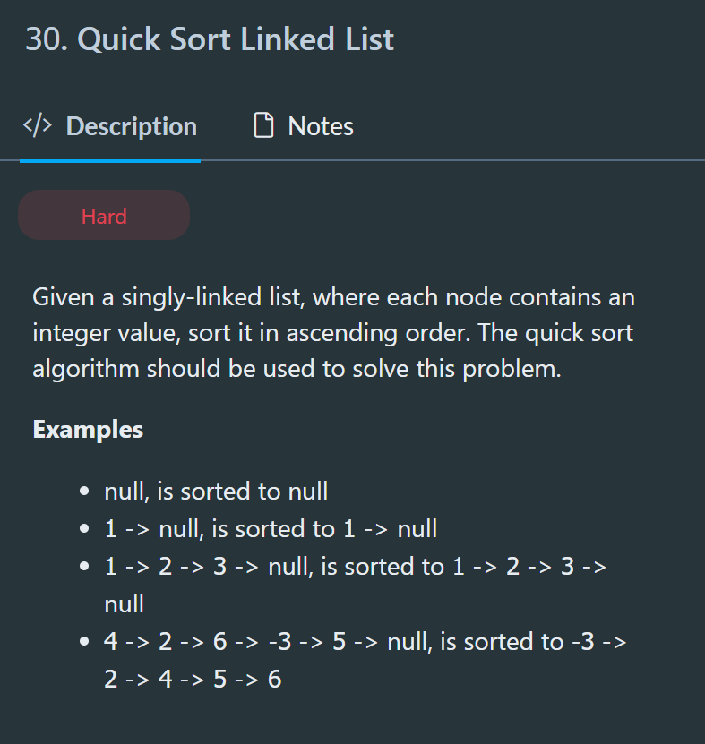

- ListNode quickSort(ListNode head)
  给定一个 head，返回一个新 head，使得链表升序排列
- Base Case
  head = null, return null
- Recursive Rule1
  - 先从头到尾判断每个数和 head 值的比较
  - 小于 head 的进入一个 LL
  - 大于 head 的进入一个 LL
- Subproblem：
  - quickSort(smallDummy.next)
  - quickSort(largeDummy.next)
  - 对两段链表进行排序
- Recursive Rule2
  - 合并：small - equal - large
