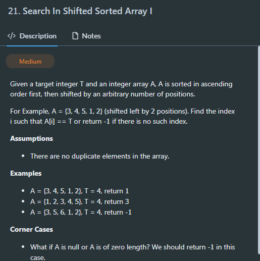

- 对于任意 index 满足 a[index] > a[len-1]的值，设 isValid(index)=true,反之为 false
- 我们要找 isValid=true 的第一个值
- 例如，对于[3,4,5,1,2], 在 isValid 处理后变为[true,true,true,false,-]
- 我们想要的 pivot 是 Last occurrance of True

- if isValid(mid) = true => left = mid （mid 是可能是答案）
- if isValid(mid) = false => right = mid-1 (mid 一定不是答案)
- 由于是 last occurrance，先判断 right 再判断 left
- 然后在两个区间中搜索

```java
public class Solution {
  public int search(int[] array, int target) {
    if (array == null || array.length == 0){
      return -1;
    }
    int pivot = findPivot(array);
    int res1 = findValue(array,0,pivot,target);
    int res2 = findValue(array,pivot+1,array.length-1,target);
    if (res1 == -1 && res2 == -1){
      return -1;
    }
    if (res1 == -1){
      return res2;
    }else{
      return res1;
    }
  }
  public int findValue(int[] array, int left, int right, int target){
    while(left <= right){
      int mid = left + (right-left)/2;
      if (array[mid] == target){
        return mid;
      }
      if (array[mid] < target){
        left = mid+1;
      }else{
        right = mid-1;
      }
    }
    return -1;
  }
  public boolean isValid(int[] array, int index){
    return array[index]>array[array.length-1];
  }
  public int findPivot(int[] array){
    if (array.length == 1){
      return 0;
    }
    int target = array[array.length-1];
    int left = 0;
    int right = array.length-2;
    while(left < right-1){
      int mid = left + (right-left)/2;
      if (isValid(array,mid)){
        left = mid;
      }else{
        right = mid-1;
      }
    }
    if (isValid(array,right)){
      return right;
    }else if (isValid(array,left)){
      return left;
    }else{
      return -1;
    }
  }
}

```
